# EvenTix - Event Management System

EvenTix is a full-stack web application for managing campus events, allowing users to browse, RSVP, and manage their event preferences. The system features both user and admin interfaces with real-time event management capabilities.

## 🚀 Features

- User Authentication (Login/Signup)
- Event Management
  - Browse upcoming events
  - RSVP to events
  - View event details
  - Cancel event registrations
- Calendar View
- User Preferences
- Admin Dashboard
  - Create new events
  - Manage event capacity
  - Track registrations

## 🛠 Screenshots

### Login Endpoint
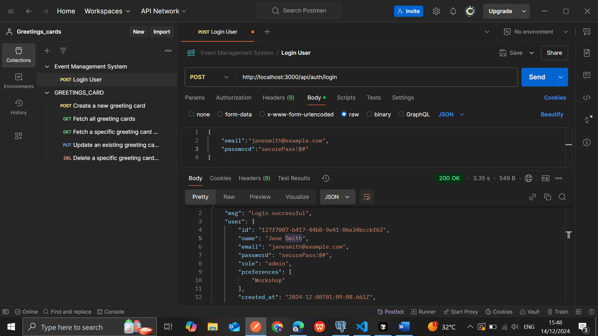

### Signup Endpoint
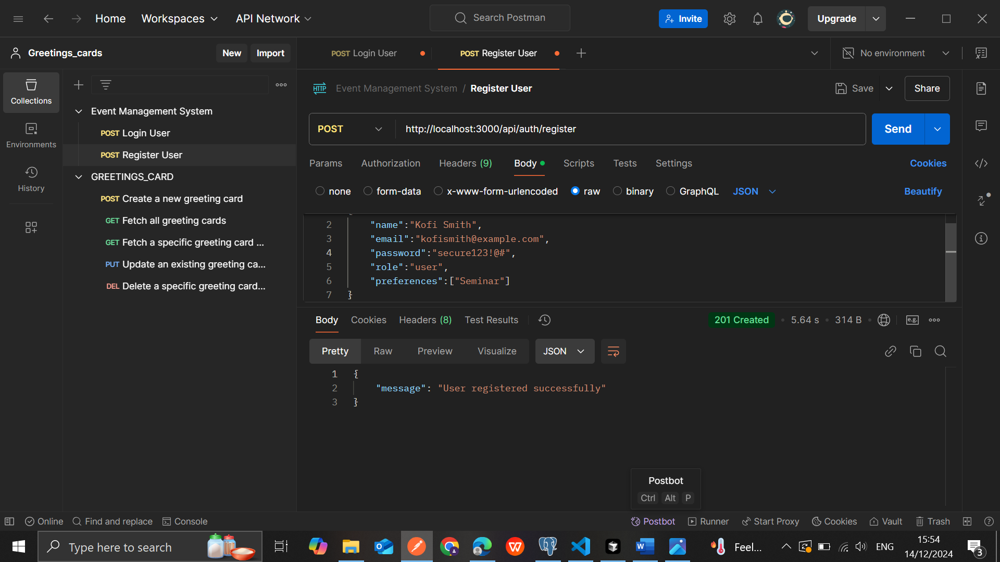

### Event Creation
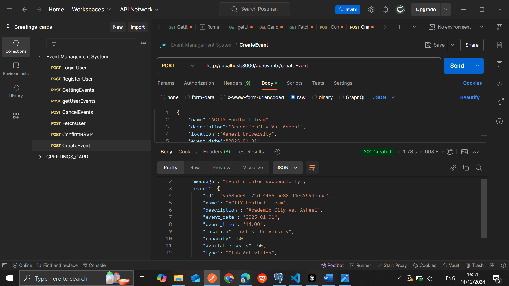
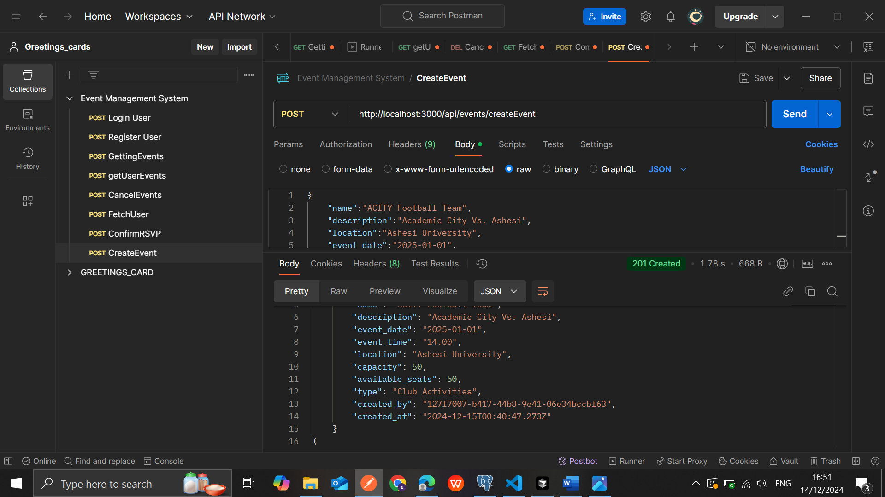

### Get Events Data
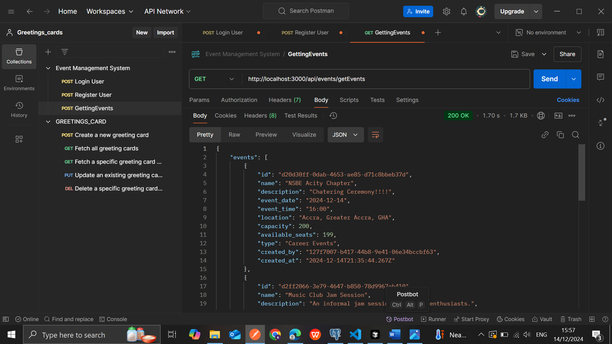
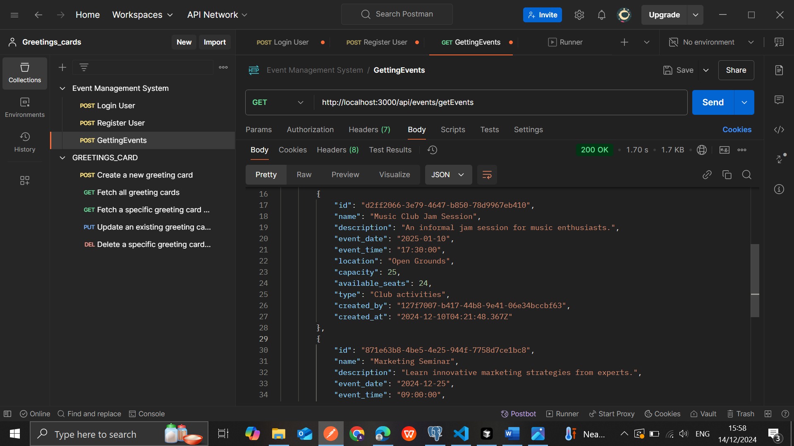
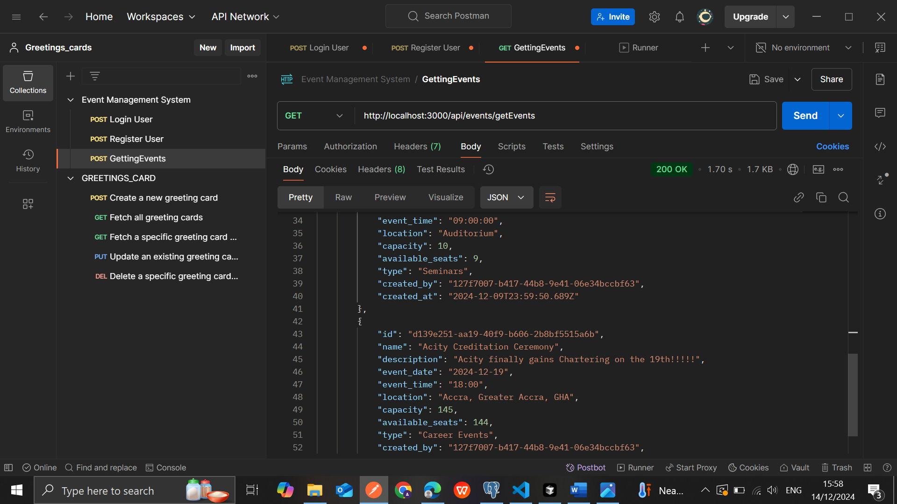
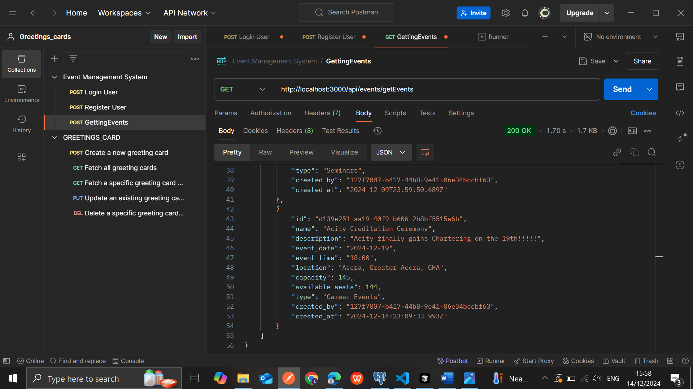

### User Event
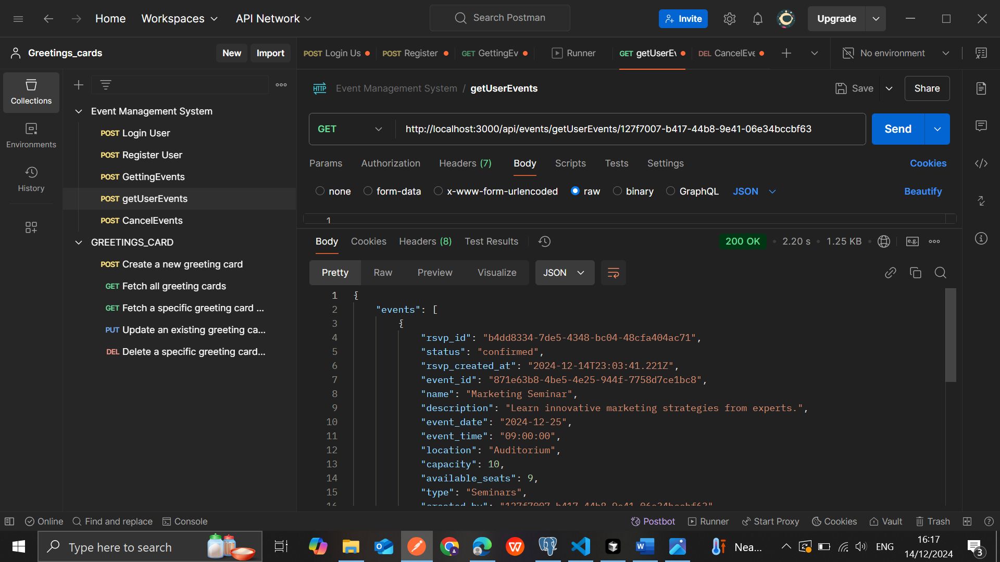
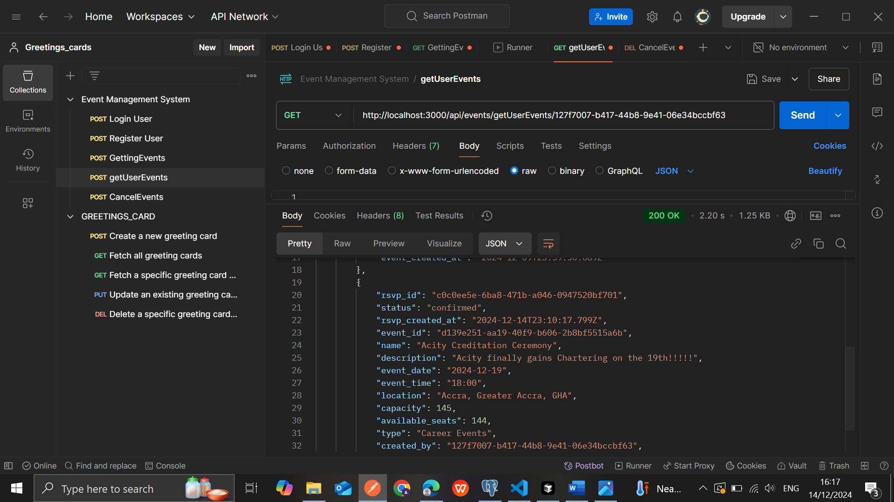

### Fetching User Events
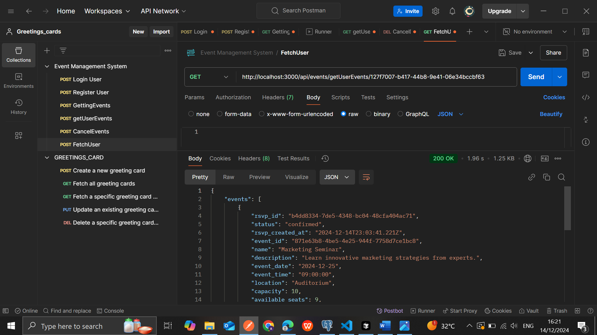
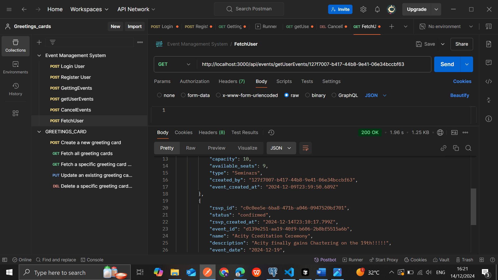
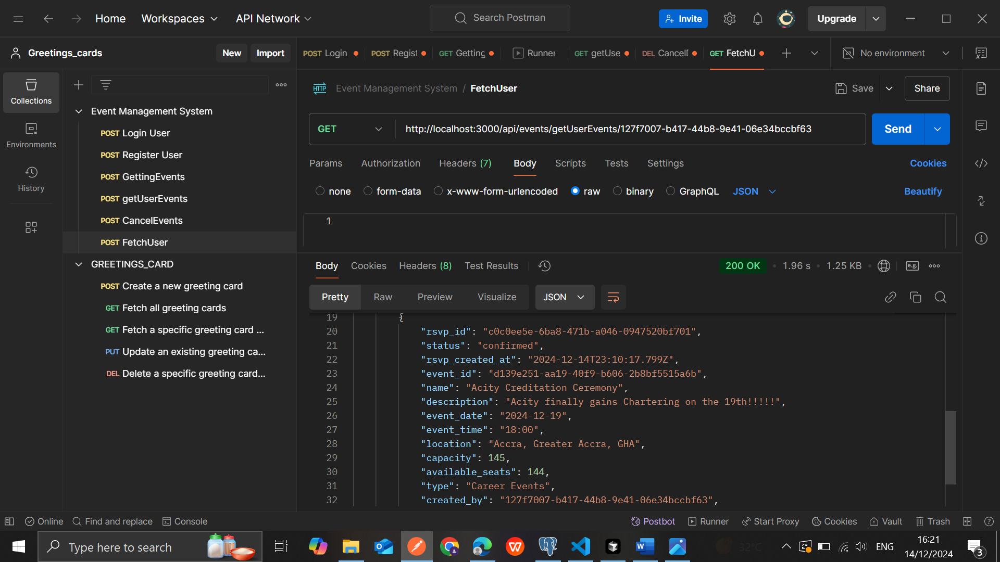

### Cancel Event
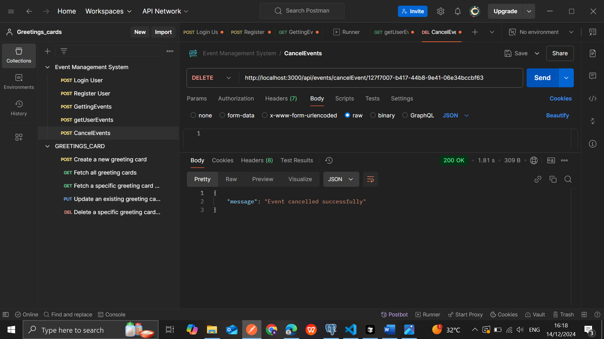

### Confirm Rsvp
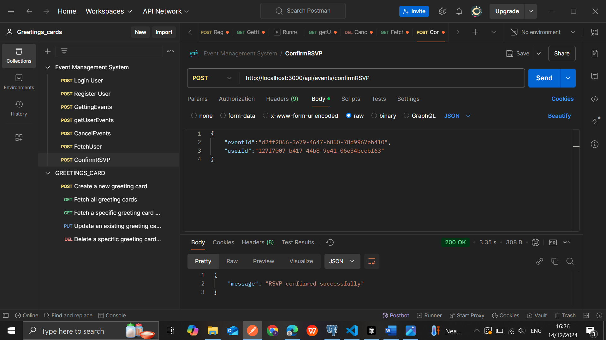

## 🛠 Tech Stack

### Frontend
- React.js with Vite
- TailwindCSS for styling
- React Router for navigation
- Axios for API requests
- React Select for multi-select components
- React Icons for UI elements

### Backend
- Node.js with Express
- PostgreSQL database
- bcryptjs for password hashing
- CORS for cross-origin resource sharing

## 📦 Installation

### Prerequisites
- Node.js (v14 or higher)
- PostgreSQL database
- npm or yarn package manager

## 🗄️ Database Schema

### Users Table
- id (Primary Key)
- name
- email
- password (hashed)
- role (admin/user)
- preferences (array)

### Events Table
- id (Primary Key)
- name
- description
- location
- event_date
- event_time
- type
- capacity
- available_seats
- created_by

### RSVPs Table
- id (Primary Key)
- user_id (Foreign Key)
- event_id (Foreign Key)
- status
- created_at

## 🔐 API Endpoints

### Authentication
- POST `/api/auth/login` - User login
- POST `/api/auth/register` - User registration

### Events
- GET `/api/events/getEvents` - Get all events
- GET `/api/events/getUserEvents/:userId` - Get user's registered events
- POST `/api/events/createEvent` - Create new event
- POST `/api/events/confirmRSVP` - RSVP to an event
- DELETE `/api/events/cancelEvent/:eventId` - Cancel event registration

## 👥 Contributing

1. Fork the repository
2. Create your feature branch (`git checkout -b feature/AmazingFeature`)
3. Commit your changes (`git commit -m 'Add some AmazingFeature'`)
4. Push to the branch (`git push origin feature/AmazingFeature`)
5. Open a Pull Request

## 📄 License

This project is licensed under the ISC License.

## 🙏 Acknowledgments

- React + Vite template
- TailwindCSS for the UI components
- PostgreSQL for the robust database system